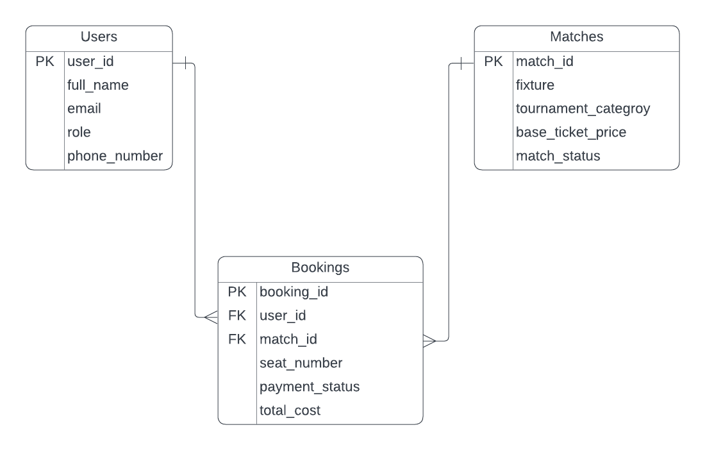

# Football Ticket Booking System

### ERD Diagram

### Project Files

- `QUERY.sql` - Contains SQL queries for the football ticket booking database.
- `Football_Ticket_Booking_System.png` - Entity Relationship Diagram for the database.
- `README.md` - Basic project documentation.

### SQL Query Overview

The `QUERY.sql` file includes queries for:

- Finding available Champions League matches.
- Searching users by name.
- Handling bookings with missing payment status.
- Joining bookings with user and match details.
- Listing users with their bookings.
- Finding bookings above the average total cost.
- Sorting matches by ticket price with pagination.
